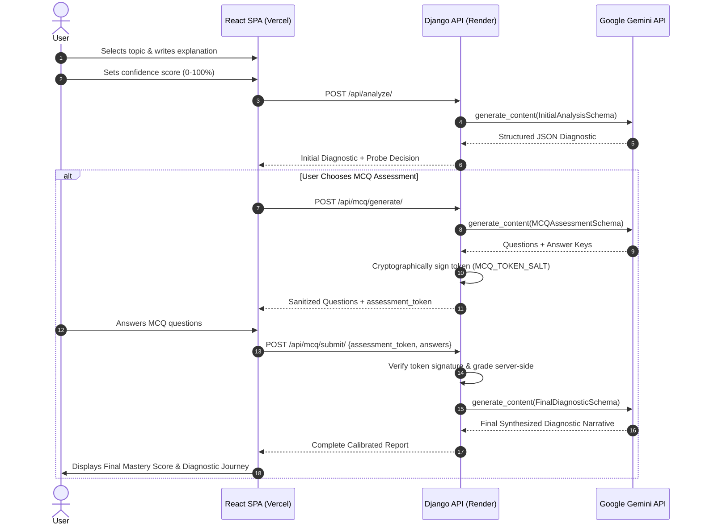
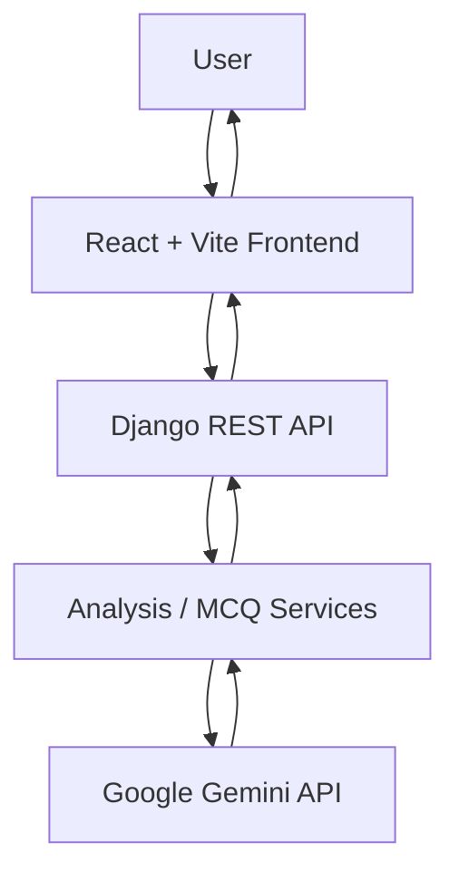

# ClarityAI — Understanding Intelligence Platform

> An AI-powered cognitive diagnostic platform designed to evaluate whether a software developer or student **actually understands** a technical concept from first principles, rather than simply recognizing or repeating memorized buzzwords.

---

## 🌐 Live Demo & Deployment Status

> **Production Status:** Live and operational  
> **Frontend Application:** [https://clarity-ai-jeel12.vercel.app](https://clarity-ai-jeel12.vercel.app) *(Hosted on Vercel)*  
> **Backend API:** [https://clarityai-dg6m.onrender.com](https://clarityai-dg6m.onrender.com) *(Hosted on Render)*  
> **Source Code Repository:** [https://github.com/JeelFinaviya/ClarityAI](https://github.com/JeelFinaviya/ClarityAI)

| Component | Platform | Status | Role |
|-----------|----------|--------|------|
| **Frontend** | Vercel | 🟢 Active | React + Vite Single-Page Application |
| **Backend API** | Render | 🟢 Active | Django REST Framework Service |
| **AI Engine** | Google Gemini API | 🟢 Active | Structured JSON Cognitive Analysis (`gemini-3.5-flash-lite`) |
| **Assessment System** | Django Cryptographic Token | 🟢 Active | Server-side Answer Key Verification & MCQ Synthesis |
| **Interview Lab** | Client-Side Bank | 🟢 Active | 22 Technical Topics & 1,100+ Curated Questions |

---

## 🎯 Why I Built ClarityAI

Traditional technical assessment tools measure **answer production**: *Can you select option B? Can you regurgitate the textbook definition of the JavaScript Event Loop?*

As a Computer Science student, I noticed a fundamental flaw in this approach: **it rewards surface-level buzzword memorization over mechanical comprehension.** A developer can easily memorize that *"the GIL prevents multi-threading in Python"* without understanding *why* CPython uses a mutex, *how* OS thread scheduling interacts with the interpreter loop, or *what* trade-offs are involved when building I/O-bound vs CPU-bound applications.

ClarityAI was designed around one core question:

> **"Do you actually understand what you're saying?"**

I built ClarityAI to act as an un-cheatable technical interviewer. The platform forces users to articulate concepts in their own words, rates their self-assessed confidence to detect blindspots, probes their explanations for missing mechanisms, and dynamically generates scenario-based multiple-choice assessments to prove causal mastery.

---

## 🧠 Core Philosophy

ClarityAI distinguishes between two fundamentally different cognitive states:

```
                  ┌─────────────────────────────────────────────────────────┐
                  │                 SURFACE FAMILIARITY                     │
                  │  "I've seen this term before and know its definition."  │
                  └────────────────────────────┬────────────────────────────┘
                                               │
                                               ▼
                  ┌─────────────────────────────────────────────────────────┐
                  │              GENUINE CAUSAL UNDERSTANDING               │
                  │  "I know step-by-step HOW it works, WHY it fails, and   │
                  │   WHAT invariants govern its operational behavior."     │
                  └─────────────────────────────────────────────────────────┘
```

### Key Diagnostic Principles:
1. **Mechanism Over Buzzwords:** A response full of technical jargon is scored low if the underlying step-by-step causality is absent.
2. **Epistemic Confidence Calibration:** Self-assessed confidence is compared directly with demonstrated depth to categorize the user as *Calibrated*, *Overconfident*, or *Underconfident*.
3. **Targeted Probing:** If an explanation omits a key invariant, the system generates a single, direct diagnostic question targeting that exact missing link.

---

## 🚀 How the Idea Evolved

```
  Phase 1: Concept Prototyping
  └── Built Django backend connecting to Gemini API for free-text explanation scoring.

  Phase 2: Structured Diagnostic Dimensions
  └── Introduced 3 core scoring metrics: Core Accuracy, Causal Depth, and Relational Coherence.

  Phase 3: Adaptive MCQ Assessment Engine
  └── Added dynamic question count determination (3, 5, or 7 questions) based on initial gaps.

  Phase 4: Security & Anti-Cheat Cryptography
  └── Created server-side answer-key token signing (`django.core.signing`) to prevent client inspection.

  Phase 5: Interview Lab Expansion
  └── Integrated a local database of 1,100+ curated questions across 22 software engineering domains.

  Phase 6: Production Engineering & Resilience
  └── Deployed to Vercel/Render, resolved 504/CORS worker timeout issues, and tuned AI model fallbacks.
```

---

## ✨ What ClarityAI Does

### 1. Interactive Concept Evaluation
* Users select from curated software engineering topics (e.g., *React Virtual DOM*, *Database B-Tree Indexing*, *CAP Theorem*, *Transformer Self-Attention*) or input any custom technical topic.
* Users explain the mechanism in plain English without looking at documentation.
* Users calibrate their confidence rating (0–100%).

### 2. Structured AI Cognitive Analysis
When submitted, the Django backend sends the text to Google Gemini using Pydantic schema validation. The AI returns:
* **Overall Score (0–100%)** and **Mastery Tier** (*Surface Familiarity*, *Developing Working Grasp*, *Solid Mechanical Understanding*, or *Deep First-Principles Mastery*).
* **Dimensional Scores:** Core Accuracy, Causal Depth, and Relational Coherence.
* **Confidence Calibration Analysis:** Diagnostic breakdown comparing confidence vs demonstrated grasp.
* **Verified Concepts:** Quotations from the explanation proving correct understanding.
* **Missing Concepts & Gaps:** Crucial mechanisms omitted by the user.
* **Possible Misconceptions:** Statement, faulty assumption, and technically grounded correction.

### 3. Diagnostic Probes & Adaptive MCQ Assessment
* **Targeted Probe:** If a major gap is detected, the AI formulates a targeted "why/how" question.
* **Adaptive MCQ Assessment:** Generates 3, 5, or 7 multiple-choice questions depending on the user's score and presence of misconceptions.
* **Anti-Buzzword Questions:** MCQs evaluate scenario-based trade-offs and process sequences rather than simple definitions.

### 4. Server-Side Graded MCQ Token System
* The backend generates a signed cryptographic token (`assessment_token`) containing the answer keys.
* The frontend receives sanitized questions **without correct answers**.
* Upon submission, the backend verifies the signature, grades the answers server-side, and synthesizes a final diagnostic report.

### 5. Interview Lab
* A searchable, zero-latency question bank containing **1,100+ questions across 22 technical topics**.
* Features 50 high-value questions per topic categorized across Frontend, Backend, Databases, Core CS, System Design, and Networking.

---

## 🔄 End-to-End User Workflow



---

## 🏗️ Interactive Architecture

> ClarityAI's repository structure and architecture can also be explored interactively through GitDiagram.

🔗 **[Open ClarityAI Architecture in GitDiagram](https://gitdiagram.com/JeelFinaviya/ClarityAI)**



---

## 🛠️ Tech Stack

| Layer | Technology | Version / Tool | Purpose |
|-------|------------|----------------|---------|
| **Frontend** | React | `v18.3.1` | Declarative UI framework & state management |
| **Build System** | Vite | `v8.2.2` | Fast HMR & production asset bundling |
| **Styling** | Tailwind CSS | `v3.4.17` | Utility-first responsive design & custom theme |
| **Icons** | Lucide React | `v0.475.0` | High-quality UI iconography |
| **Backend** | Python | `3.14 / 3.11` | Server runtime environment |
| **Framework** | Django | `v6.1.1` | Core backend web framework & ORM |
| **API Layer** | Django REST Framework | `v3.15.2` | RESTful API endpoint serializers & views |
| **CORS Control** | django-cors-headers | `v4.7.0` | Cross-Origin Resource Sharing control |
| **AI SDK** | Google GenAI SDK | `v2.0.0+` | Official Google Gemini API client |
| **Schema Validation**| Pydantic | `v2.10.6` | Strict JSON schema typing for AI responses |
| **Frontend Hosting** | Vercel | Production | Static asset distribution & global CDN |
| **Backend Hosting** | Render | Production | Cloud Web Service runner for Django |

---

## 🤖 AI Analysis Pipeline

ClarityAI uses the official `google-genai` SDK with strict JSON response schema enforcement via Pydantic.

```python
# Model Fallback Chain in backend/analysis/gemini_service.py
def _get_candidate_models() -> list[str]:
    configured = os.getenv('GEMINI_MODEL') or getattr(settings, 'GEMINI_MODEL', 'gemini-3.5-flash-lite')
    candidates = [configured] if configured else []
    for model in ['gemini-3.5-flash-lite', 'gemini-3.1-flash-lite', 'gemini-3.6-flash', 'gemini-3.5-flash']:
        if model not in candidates:
            candidates.append(model)
    return candidates
```

### Resilient AI Execution Workflow:
1. **Backend Isolation:** The `GEMINI_API_KEY` is stored strictly in server environment variables and is **never** sent to the client.
2. **Schema Enforcement:** Calls to `generate_content` use `response_mime_type="application/json"` and supply `response_schema` (e.g. `InitialAnalysisSchema`).
3. **Controlled Retries:** If a model returns 503 or 429 quota exhaustion, the service catches `ServerError`/`APIError`, waits 1 second, and automatically retries with candidate models (`gemini-3.5-flash-lite` $\rightarrow$ `gemini-3.1-flash-lite`).
4. **Graceful Degradation:** If Gemini is unreachable, DRF returns structured HTTP 502/503 JSON errors with user-friendly actionable messages.

---

## 🎲 Adaptive MCQ Assessment Architecture

To prevent users from viewing answer keys in browser developer tools:

```text
[Backend: generate_mcq_assessment()]
              │
              ├── 1. Gemini generates questions, distractor options, and correct_answer index.
              ├── 2. Backend packages full assessment payload.
              ├── 3. Backend signs token: assessment_token = signing.dumps(payload, salt=MCQ_TOKEN_SALT)
              └── 4. Backend strips correct_answer & explanation from questions array.
              │
              ▼
[Client Browser receives sanitized JSON + assessment_token]
              │
              ├── User selects options (0, 1, 2, or 3)
              └── Client POSTs { assessment_token, answers } to /api/mcq/submit/
              │
              ▼
[Backend: submit_mcq_assessment()]
              │
              ├── 1. Decodes token: payload = signing.loads(assessment_token, max_age=86400)
              ├── 2. Compares user answers against cryptographically verified answer keys.
              └── 3. Passes empirical evidence to Gemini for final diagnostic synthesis.
```

---

## 📚 Interview Lab

The Interview Lab is a built-in repository of **1,100+ curated technical questions across 22 domains**:

### Covered Topics (50 Questions Each):
1. **Frontend:** React, JavaScript, HTML5/CSS3, TypeScript
2. **Backend:** Node.js, Python, Java, Go, System Architecture
3. **Databases:** PostgreSQL, MongoDB, Redis, SQL Optimization
4. **Core CS:** Data Structures, Algorithms, Operating Systems, Computer Networks
5. **DevOps & Architecture:** Docker & Kubernetes, CI/CD Pipelines, Microservices, Git & Version Control, Security & Cryptography

The Interview Lab operates with zero API latency as data is structured locally in `frontend/src/data/interviewLabData.js`.

---

## 📡 Backend API Reference

### 1. Initial Concept Analysis
* **Endpoint:** `POST /api/analyze/`
* **Payload:**
  ```json
  {
    "topic": "JavaScript Event Loop",
    "explanation": "The call stack executes synchronous code while async callbacks go to microtask/macrotask queues.",
    "confidence": 80
  }
  ```
* **Response (HTTP 200 OK):** Structured initial diagnostic JSON containing scores, dimensions, missing concepts, misconceptions, and probe decision.

### 2. Generate MCQ Assessment
* **Endpoint:** `POST /api/mcq/generate/`
* **Payload:** `{ "topic": "...", "explanation": "...", "confidence": 80, "initial_diagnostic": {...} }`
* **Response (HTTP 200 OK):** `{ "assessment_token": "...", "question_count": 5, "questions": [...] }`

### 3. Submit MCQ Assessment
* **Endpoint:** `POST /api/mcq/submit/`
* **Payload:** `{ "assessment_token": "...", "topic": "...", "initial_explanation": "...", "confidence": 80, "answers": [...] }`
* **Response (HTTP 200 OK):** Final synthesized diagnostic report JSON.

### 4. Diagnostic History
* **List History:** `GET /api/history/?search=react&sort=highest`
* **Save Record:** `POST /api/history/`
* **Detail Record:** `GET /api/history/<uuid:pk>/`
* **Delete Record:** `DELETE /api/history/<uuid:pk>/`

---

## 🔒 Security & Reliability Engineering

* **API Key Security:** `GEMINI_API_KEY` remains strictly on the Django backend.
* **Cryptographic Token Verification:** Assessment tokens are cryptographically signed using `django.core.signing.TimestampSigner` logic with 24-hour expiration.
* **CORS Header Guarantee:** `OpenCorsMiddleware` is placed at the top of Django's middleware stack, ensuring `Access-Control-Allow-Origin` headers are attached to every response (including 400 validation errors, 500 exceptions, and 503 unavailability).
* **Input Validation:** Input is sanitized using Django REST Framework serializers and Pydantic validators.

---

## 🛠️ Production Problem I Solved: MCQ Timeout Behind CORS Error

### The Bug:
When submitting MCQ assessments in production, the browser console reported:
```text
Access to fetch at 'https://clarityai-dg6m.onrender.com/api/mcq/submit/' from origin 'https://clarity-ai-jeel12.vercel.app' 
has been blocked by CORS policy: No 'Access-Control-Allow-Origin' header is present on the requested resource.
```

### Investigation & Root Cause:
1. I initially suspected misconfigured Django `CORS_ALLOWED_ORIGINS`. However, checking OPTIONS preflight requests and invalid POST requests showed that Django correctly returned CORS headers.
2. Further investigation revealed that the issue was actually an **upstream 504 Gateway Timeout**.
3. During MCQ synthesis, Gemini API model retries were performing exponential backoff across 3 attempts on overloaded models (`gemini-3.6-flash`). This caused the request duration to exceed Render's 30-second Gunicorn worker limit.
4. When Gunicorn dropped the connection, Render's proxy returned an HTML 504 Gateway Timeout page. Because Render's proxy page lacked CORS headers, the browser surfaced the failure as a deceptive **CORS error**.

### The Solution:
* Reduced Gemini retry attempts from 3 to 2 per model.
* Replaced exponential retry backoff with a controlled 1-second delay.
* Updated candidate model prioritization to high-throughput models (`gemini-3.5-flash-lite`).
* Placed `OpenCorsMiddleware` at the absolute top of Django's middleware chain.

### Verification Result:
* MCQ synthesis requests returned **HTTP 200 OK**.
* Local synthesis test verified in **7.98 seconds**.
* Django test suite: **19/19 passed cleanly**.

---

## 🧪 Testing & Verification

```bash
# Run backend test suite
cd backend
.\venv\Scripts\python.exe manage.py test
```

### Results:
* **Django Unit Tests:** `19/19 passed` (0 failures, 0 errors).
* **Frontend Production Build:** `npm run build` completed in 739ms (`1,854 modules transformed`).

---

## 🖼️ Product Screenshots

*(Screenshots can be found in [`docs/screenshots/`](file:///d:/ClarityAI/docs/screenshots/README.md))*

1. **`01-landing.png`**: Dual Pillar Landing Page (Concept Explorer & Interview Lab).
2. **`02-analysis.png`**: Articulate Concept Explanation input view.
3. **`03-analysis-result.png`**: Initial Evaluation, Core Accuracy, Causal Depth, and Calibration Index.
4. **`04-diagnostic.png`**: Targeted Diagnostic Probe question.
5. **`05-mcq.png`**: Adaptive Multiple Choice Question assessment.
6. **`06-final-diagnostic.png`**: Final Synthesized Diagnostic Report & Mastery Journey.
7. **`08-interview-lab.png`**: Interview Lab with 22 Technical Topics & 1,100+ Questions.

---

## 📂 Directory Structure

```text
ClarityAI/
├── docs/
│   └── screenshots/          # Product screenshots & visual artifacts
├── backend/
│   ├── analysis/             # Core AI Diagnostic Application
│   │   ├── gemini_service.py # Gemini SDK integration & Pydantic schemas
│   │   ├── middleware.py     # Guaranteed CORS header middleware
│   │   ├── models.py         # DiagnosticRecord database schema
│   │   ├── serializers.py    # DRF input/output validators
│   │   ├── tests.py          # Django unit test suite
│   │   ├── urls.py           # API endpoint routing
│   │   └── views.py          # API view controllers
│   ├── clarity/              # Project settings & WSGI configuration
│   │   ├── settings.py
│   │   ├── urls.py
│   │   └── wsgi.py
│   ├── db.sqlite3            # Persistence database
│   ├── manage.py
│   ├── requirements.txt
│   └── .env.example
├── frontend/
│   ├── src/
│   │   ├── components/       # Header, Navigation, Modals
│   │   ├── data/             # interviewLabData.js (1,100+ questions)
│   │   ├── pages/            # LandingPage, ExplainPage, ConfidencePage, etc.
│   │   ├── services/         # api.js (Fetch API communication layer)
│   │   ├── App.jsx           # Main routing & state controller
│   │   └── main.jsx
│   ├── package.json
│   ├── vite.config.js
│   └── .env.example
└── CLARITYAI_PROJECT.md
```

---

## 🚀 Future Implementation Roadmap

* **Phase 1 (User Accounts & Persistence):** PostgreSQL integration with user authentication to track conceptual progress over time.
* **Phase 2 (Concept Knowledge Graphs):** Map dependencies between prerequisites (e.g., *Memory Management* $\rightarrow$ *Pointers* $\rightarrow$ *B-Trees*).
* **Phase 3 (Spaced Repetition Diagnostics):** Re-test previously identified misconceptions after 7 days to verify long-term retention.
* **Phase 4 (AI Audio Probing):** Voice-based spoken explanation analysis using Google Gemini Multimodal Live API.

---

## 👨‍💻 What I Learned Building ClarityAI

Building ClarityAI taught me invaluable lessons in full-stack architecture and production engineering:

1. **AI Output Is Unreliable Without Strict Schemas:** Relying on free-form AI text leads to broken UIs. Using Pydantic response schemas with `google-genai` transformed AI into a predictable, typed backend service.
2. **Browser CORS Errors Can Mask Upstream Failures:** A 504 Gateway Timeout or unhandled crash without headers presents in DevTools as a CORS error. Investigating raw HTTP responses is critical to finding the true root cause.
3. **Security Must Be Built Into Design:** Keeping API keys strictly server-side and cryptographically signing assessment tokens ensures client-side devtools cannot compromise assessment integrity.

---

## 👤 Author

**Finaviya Jeelkumar Janakbhai**  
*B.Tech in Computer Science & Information Technology*  
*LJ University*

* **GitHub:** [https://github.com/JeelFinaviya](https://github.com/JeelFinaviya)  
* **LinkedIn:** [https://www.linkedin.com/in/jeel-finaviya-8930ba370/](https://www.linkedin.com/in/jeel-finaviya-8930ba370/)

---

> **ClarityAI** — *Technology should not only give us answers. It should help us discover whether we truly understand them.*
